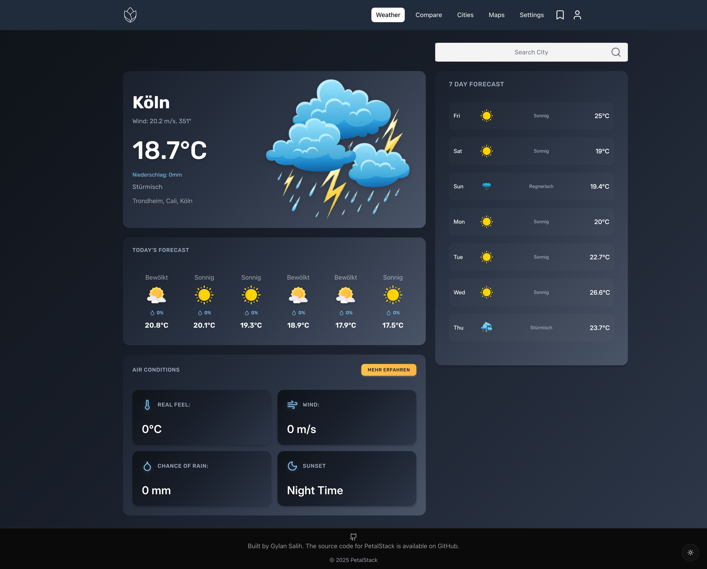
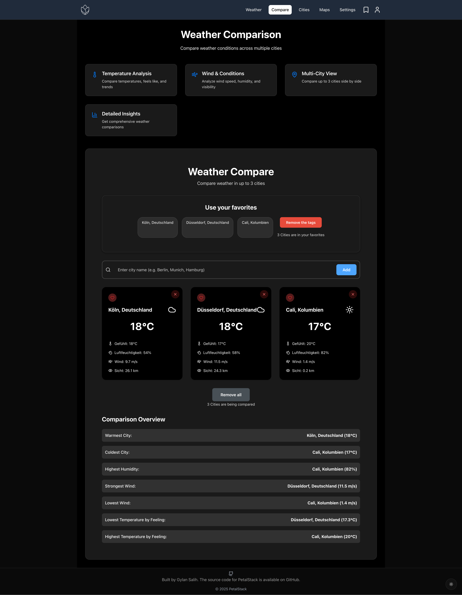
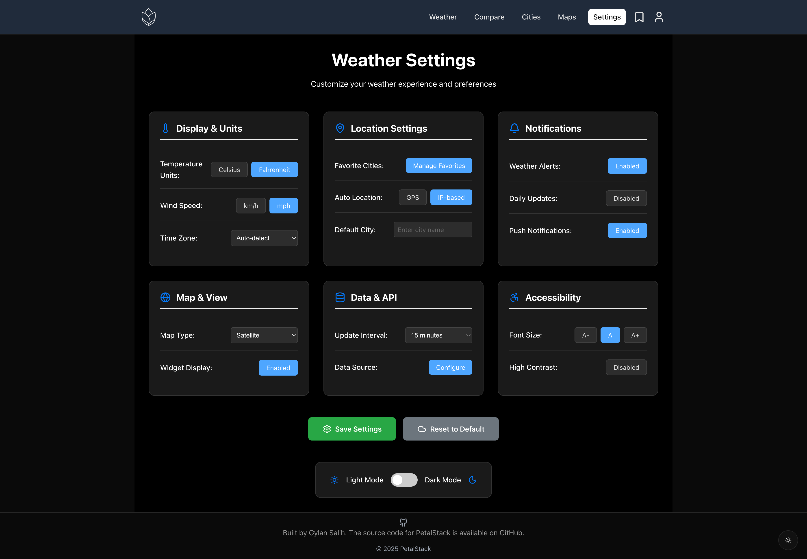
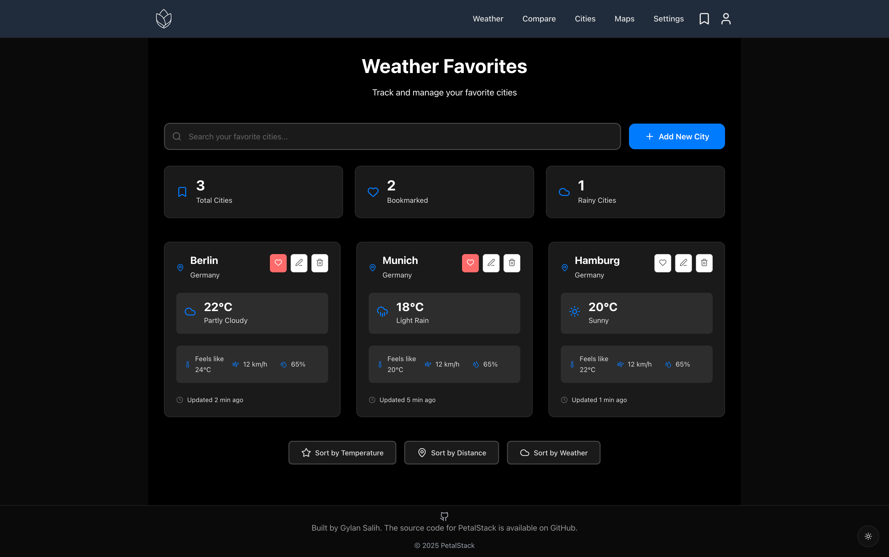
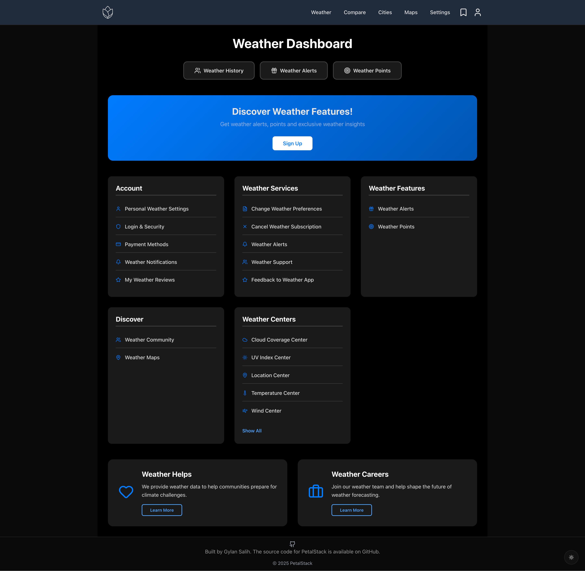

[![Contributors][contributors-shield]][contributors-url]
[![Forks][forks-shield]][forks-url]
[![Stargazers][stars-shield]][stars-url]
[![Issues][issues-shield]][issues-url]
[![MIT License][license-shield]][license-url]

<!-- Badges Shields -->
[contributors-shield]: https://custom-icon-badges.demolab.com/github/contributors/GylanSalih/Weather-App?color=FF0000&logo=group&label=Contributors&logoColor=white&style=for-the-badge&labelColor=000000
[forks-shield]: https://custom-icon-badges.demolab.com/github/forks/GylanSalih/Weather-App?color=FF0000&logo=repo-forked&label=Forks&logoColor=white&style=for-the-badge&labelColor=000000
[stars-shield]: https://custom-icon-badges.demolab.com/github/stars/GylanSalih/Weather-App?color=FF0000&label=Stars&style=for-the-badge&logo=star&logoColor=white&labelColor=000000
[issues-shield]: https://custom-icon-badges.demolab.com/github/issues/GylanSalih/Weather-App?color=FF0000&logo=issue-opened&label=Issues&logoColor=white&labelColor=000000&style=for-the-badge
[license-shield]: https://custom-icon-badges.demolab.com/github/license/GylanSalih/Weather-App?color=FF0000&logo=law&label=License&logoColor=white&style=for-the-badge&labelColor=000000

<!-- Badges Links -->
[contributors-url]: https://github.com/GylanSalih/Weather-App/graphs/contributors
[forks-url]: https://github.com/GylanSalih/Weather-App/network/members
[stars-url]: https://github.com/GylanSalih/Weather-App/stargazers
[issues-url]: https://github.com/GylanSalih/Weather-App/issues
[license-url]: https://github.com/GylanSalih/Weather-App/blob/main/LICENSE

<!-- PROJECT LOGO -->
 

  
  
  
  
  
  
  

<h3 align="center">
  Weather App - Modern Weather Dashboard
</h3>

   Get real-time weather information for any city worldwide! A beautiful, responsive weather application built with React & TypeScript 
     
     
    <a href="#getting-started"><strong>Get Started »</strong></a>
     
     
    <a href="#demo">View Demo</a>
    ·
    <a href="https://github.com/GylanSalih/Weather-App/issues/new?labels=bug&template=bug-report---.md">Report Bug</a>
    ·
    <a href="https://github.com/GylanSalih/Weather-App/issues/new?labels=enhancement&template=feature-request---.md">Request Feature</a>

<!-- TABLE OF CONTENTS -->

  
Table of Contents

  <ol>
    <li><a href="#about-the-project">About The Project</a></li>
    <li><a href="#features">Features</a></li>
    <li><a href="#built-with">Built With</a></li>
    <li><a href="#getting-started">Getting Started</a></li>
    <li><a href="#contributing">Contributing</a></li>
    <li><a href="#license">License</a></li>
    <li><a href="#contact">Contact</a></li>
  </ol>

<h2 id="about-the-project"> About The Project</h2>

  
  
**Mission:** Weather App is a modern, responsive weather dashboard that provides real-time weather information for cities worldwide. Built with cutting-edge web technologies, it offers an intuitive user experience with beautiful visualizations and comprehensive weather data.

&nbsp;

<h2 id="features"> Features</h2>

### 🌤️ Core Weather Features
- **Real-time Weather Data** from OpenWeatherMap API
- **City Search** with autocomplete functionality
- **7-Day Forecast** with detailed weather predictions
- **Current Conditions** including temperature, humidity, pressure
- **Wind & Visibility** information for outdoor activities
- **Weather Icons** representing current conditions

### 🎯 User Experience
- **City Comparison Tool** - Compare weather in up to 3 cities
- **Favorites System** - Save your favorite cities for quick access
- **Dark Mode** - Beautiful dark theme for comfortable viewing
- **Responsive Design** - Works perfectly on all devices
- **Local Storage** - Your preferences are saved locally

### 🛠️ Developer Experience
- **TypeScript** for type safety and better development
- **SCSS Modules** for maintainable and scalable styling
- **React Hooks** for modern state management
- **Context API** for global state management
- **Custom Hooks** for reusable logic

### 🎨 User Interface
- **Modern UI Design** with smooth animations
- **Lucide Icons** for consistent iconography
- **Custom Weather Icons** for different conditions
- **Responsive Grid Layout** for optimal viewing
- **Beautiful Color Schemes** for light and dark modes

  

  

<h2 id="built-with"> Built With</h2>

<ul>
  <li>
    
  </li>
  <li>
    
  </li>
  <li>
    
  </li>
  <li>
    
  </li>
  <li>
    
  </li>
  <li>
    
  </li>
</ul>

  

##  License

Distributed under the MIT License. See `LICENSE` for more information.

  

##  Contact

  
  
    
  
  
 If you like this project, please consider starring it on GitHub! Your support is greatly appreciated! 

